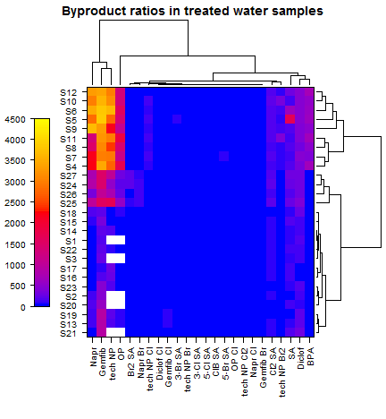
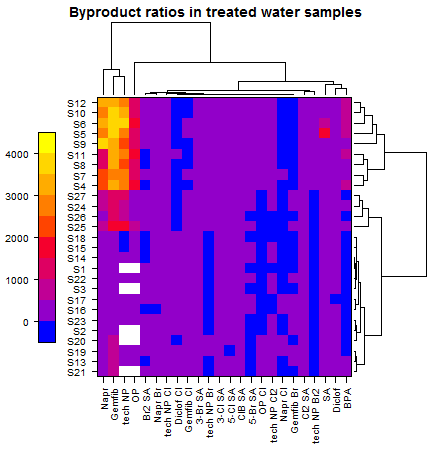
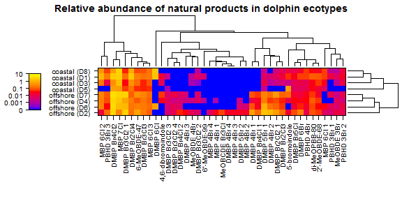

[GitHub Repository for this Script](https://github.com/OrgMassSpec/Misc)  
[OrgMassSpecR Homepage](http://OrgMassSpec.github.io/)

Heat maps and hierarchical clustering concisely display and compare sample contaminant profiles by similarity. They can also be used as a quality control step to check for missing or otherwise unexpected data. The following examples rely on the lattice and latticeExtra packages.


```r
library(lattice)
library(latticeExtra)
```

```
## Loading required package: RColorBrewer
```

# Basic Linear Scale

Here, non-detects were set to a value of zero. Missing values ("No IS") were set to `NA` and appear as white (empty) cells. Compounds with very low values are binned as having apparent values of zero (blue).


```r
# Read data
x <- read.csv("Example 1 Data.csv", stringsAsFactors = FALSE)

# Set up matrix by moving sample codes from first column to row names
sampleCodes <- x[, 1] # Grab sample codes
heatmapMatrix <- data.matrix(x[, -1]) # Remove first column
rownames(heatmapMatrix) <- sampleCodes # Assign as row names

# Clustering
# heatmapMatrix <- t(heatmapMatrix) # To flip the figure, if needed
rowDendrogram <- as.dendrogram(hclust(dist(heatmapMatrix)))
rowOrder <- order.dendrogram(rowDendrogram)
columnDendrogram <- as.dendrogram(hclust(dist(t(heatmapMatrix))))
columnOrder <- order.dendrogram(columnDendrogram)

# Plot
lattice.options(axis.padding=list(factor = 0.5)) # Sets padding between heatmap and box

p1 <- levelplot(heatmapMatrix[rowOrder, columnOrder],
                aspect = "fill", 
                scales = list(x = list(rot = 90), tck = c(1,0)),
                # Specify key color ramp
                colorkey = list(space = "left", 
                                col = colorRampPalette(c("blue", "red", "yellow"), 
                                                       space = "Lab")(100),
                                height = 0.75),
                # Specify plot color ramp (same as key)
                col.regions = colorRampPalette(c("blue", "red", "yellow"), 
                                               space = "Lab")(100),
                xlab = NULL, ylab = NULL, pretty = TRUE, 
                main = "Byproduct ratios in treated water samples",
                # Set range and number of breakpoints in intensity data,
                # length.out should match the number of number of colors
                # specified for the ke and plot.
                at = seq(0, 4500, length.out = 100),
                # Set dendogram position
                par.settings = list(layout.widths = list(axis.key.padding = -1.5),
                                    layout.heights = list(key.axis.padding = -1.5)),
                # Draw dendograms
                legend =
                  list(right = list(fun = dendrogramGrob,
                                    args = list(x = columnDendrogram, 
                                                side = "right", 
                                                size = 5)),                      
                       top = list(fun = dendrogramGrob,
                                  args = list(x = rowDendrogram, 
                                              side = "top", 
                                              size = 5)))
)

print(p1)
```



# Linear Scale Emphasizing Non-Detects

In this example the color ramp is modified to highlight the difference between detects and non-detects.


```r
p2 <- levelplot(heatmapMatrix[rowOrder, columnOrder],
          aspect = "fill", scales = list(x = list(rot = 90), tck = c(1,0)),
          colorkey = list(space = "left", 
                          col = colorRampPalette(c("blue", "red", "yellow"), 
                                                 space = "Lab")(10),
                          height = 0.75),
          col.regions = colorRampPalette(c("blue", "red", "yellow"), 
                                         space = "Lab")(10),
          xlab = NULL, ylab = NULL, cuts = 10, pretty = TRUE,
          main = "Byproduct ratios in treated water samples",
          par.settings = list(layout.widths = list(axis.key.padding = -1.5),
                              layout.heights = list(key.axis.padding = -1.5)),
          legend =
            list(right = list(fun = dendrogramGrob,
                              args = list(x = columnDendrogram, 
                                          side = "right", 
                                          size = 5)),                      
                 top = list(fun = dendrogramGrob,
                            args = list(x = rowDendrogram, 
                                        side = "top", 
                                        size = 5)))
)

print(p2)
```



# Log Scale

This example illustrates generation of a log-scale heat map. Since the data contains non-detects that are set to zero, and taking log~10~(0) is not possible, the data is scaled by log~10~(x + 0.0001). The plot scale is then adjusted to show the original values. The example also illustrates:

* The combination of strings to make new sample names. 
* Conversion of the data set from a "tall" format to "wide" format. This introduces `NAs` when compounds were not reported (not detected) in the original data set. Since log~10~(0.0001) = -4, `NAs` are replaced with the value -4.


```r
# Read data
x <- read.csv("Example 2 Data.csv", stringsAsFactors = FALSE, na.strings = c("", "NA"))

# Subset data and prepate sample names
x <- x[x$Category1 == "natural", ]
x$SampleCode <- paste(x$Ecotype, " (", substr(x$Sample, (nchar(x$Sample) - 2) + 1, nchar(x$Sample)), ")", sep = "")
heatmapData <- x[, c("SampleCode", "Compound", "RelativeArea")]

# Convert to log scale
heatmapData$RelativeArea <- log10(heatmapData$RelativeArea + 0.0001) 

# Convert to wide format
heatmapData <- reshape(heatmapData,
                       v.names = "RelativeArea",
                       idvar = "SampleCode",
                       timevar = "Compound",
                       direction = "wide")

heatmapMatrix <- data.matrix(heatmapData[, -1]) # Remove first column

# Convert non-detects
heatmapMatrix[is.na(heatmapMatrix)] <- -4

# Prepare row and column names
rownames(heatmapMatrix) <- heatmapData$SampleCode
colnames(heatmapMatrix) <- sapply(strsplit(colnames(heatmapMatrix), split = ".", fixed = TRUE), "[[", j = 2)

# Clustering
heatmapMatrix <- t(heatmapMatrix)
rowDendrogram <- as.dendrogram(hclust(dist(heatmapMatrix)))
rowOrder <- order.dendrogram(rowDendrogram)
columnDendrogram <- as.dendrogram(hclust(dist(t(heatmapMatrix))))
columnOrder <- order.dendrogram(columnDendrogram)

lattice.options(axis.padding=list(factor = 0.5))

p3 <- levelplot(heatmapMatrix[rowOrder, columnOrder],
          aspect = "fill", 
          scales = list(x = list(rot = 90), tck = c(1,0)),
          # scales = list(x = list(draw = FALSE)), # To remove axis if needed
          colorkey = list(space = "left",
                          col = colorRampPalette(c("blue", "red", "yellow"), 
                                                 space = "Lab")(100),
                          height = 0.75,
                          labels = list(at = c(log10(0+0.0001),
                                               log10(0.001+0.0001),
                                               log10(0.01+0.0001),
                                               log10(0.1+0.0001),
                                               log10(1+0.0001),
                                               log10(10+0.0001)),
                                        labels = c(0, 0.001, 0.01, 0.1, 1, 10)
                          )
          ),
          col.regions = colorRampPalette(c("blue", "red", "yellow"), space = "Lab")(100),
          xlab = NULL, ylab = NULL, 
          main = "Relative abundance of natural products in dolphin ecotypes",
          at = seq(log10(0.0001), log10(10 + 0.0001), length.out = 100),
          par.settings = list(layout.widths = list(axis.key.padding = -1.5),
                              layout.heights = list(key.axis.padding = -1.5)),
          legend =
            list(right = list(fun = dendrogramGrob,
                              args = list(x = columnDendrogram, side = "right", size = 5)),
                 top = list(fun = dendrogramGrob,
                            args = list(x = rowDendrogram, side = "top", size = 5)))
)

print(p3)
```




```r
# Extract code
# library(knitr)
# purl("HeatMaps.Rmd") 
```

