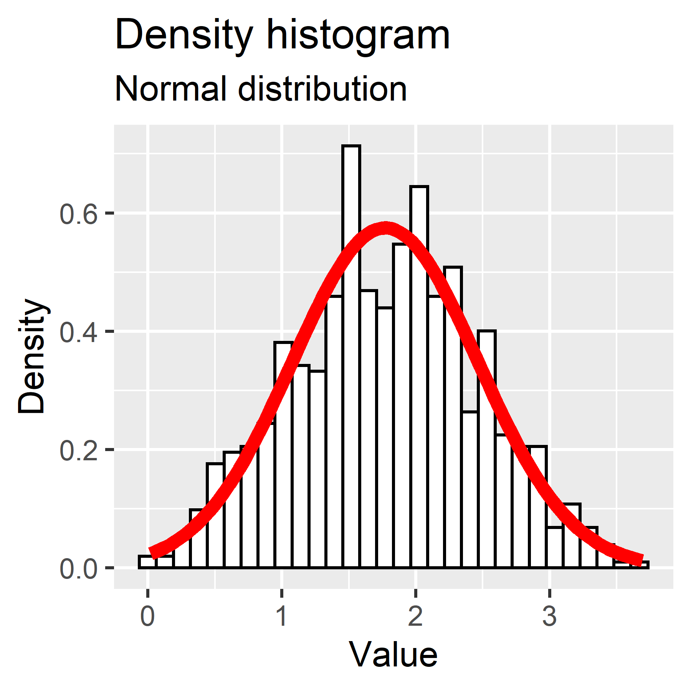
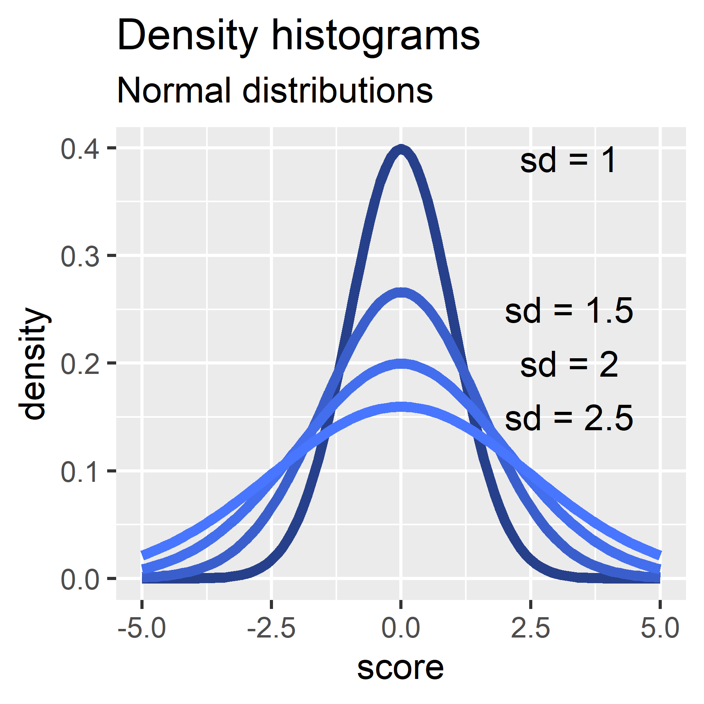
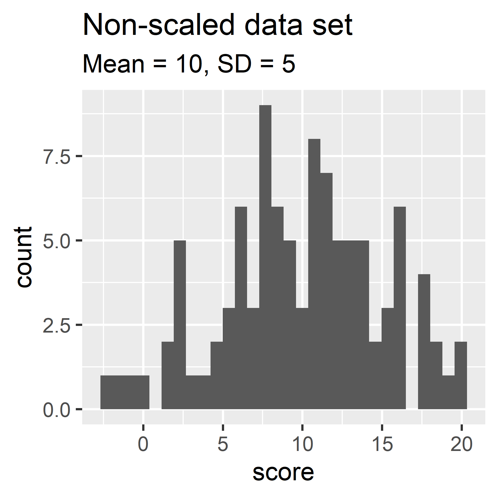
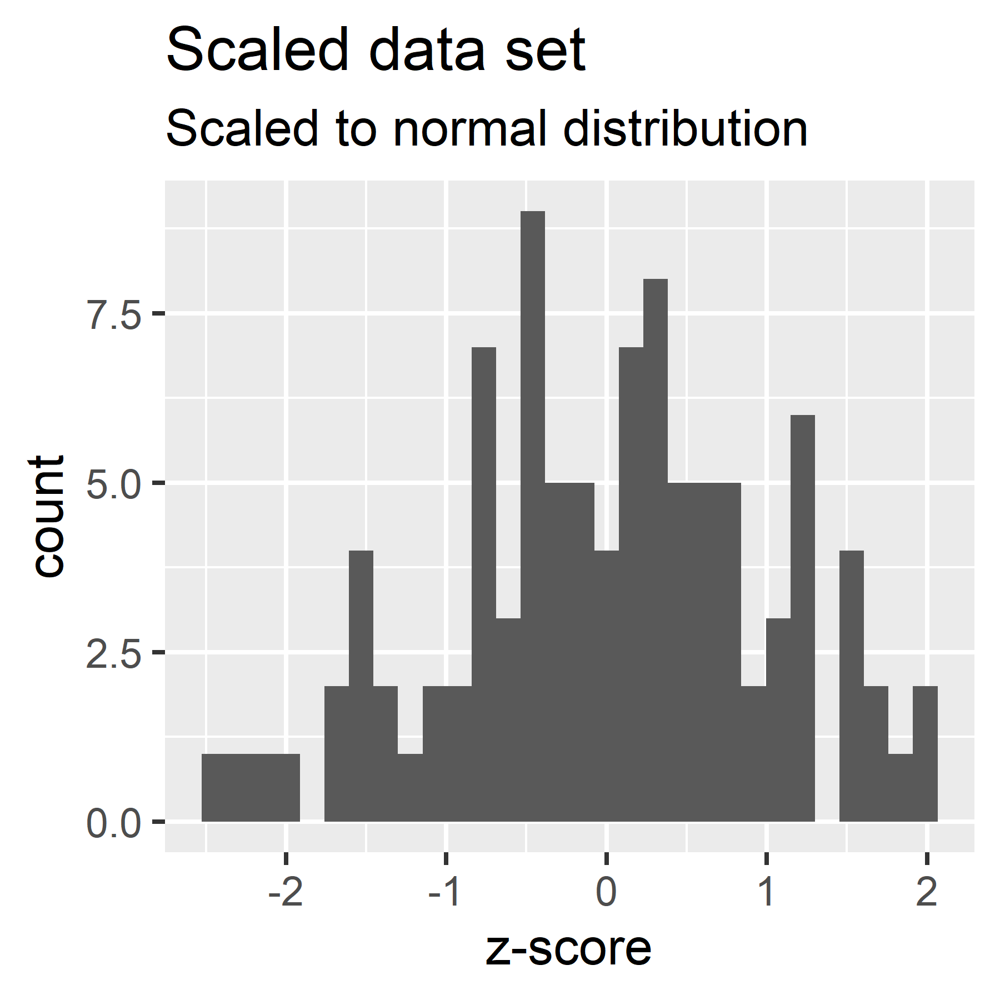
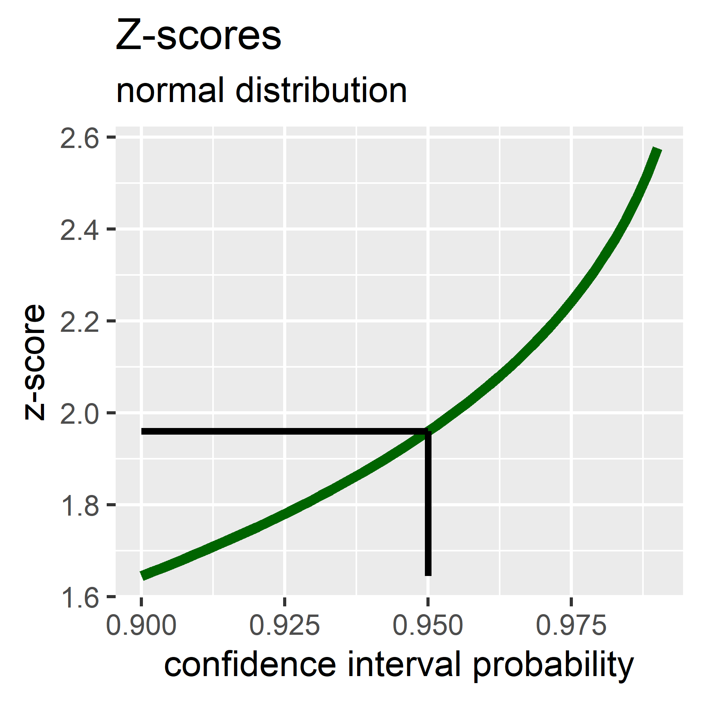
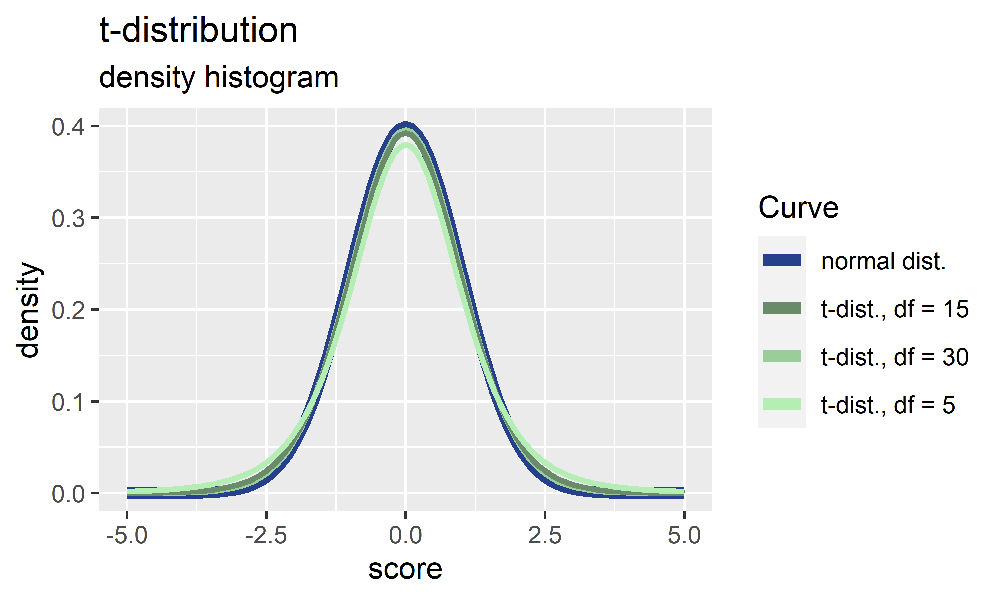

# Probability Distributions

## Normal distribution
Distributions show the frequency (or probability) of obtaining a particular score. **Normal distribution**: mean of zero and standard deviation of 1. Probability distributions are idealized. The probability of obtaining a particular score (x-axis) can be calculated based on the frequency of the score in the distribution. Score probabilities have been calculated for the normal distribution ($\bar{x} = 0$ and $s = 1$).



```
Normal Distribution.R
```

## Density histogram
In a density histogram the area of each bin equals its relative frequency, and the area of the entire histogram is one.

Density histograms of various normal distributions:



```
Normal Distribution.R
```

## Z-score
A data set of scores converted to the normal distribution have **z-scores (z)** of

$$z = \frac{x_i - \bar{x}}{s}$$

where $x_i$ = score, $\bar{x}$ = mean score, and $s$ = standard deviation. Dividing by $s$ results in data with a standard deviation of 1.





```
Z_Scores.R
Generated using rnorm() and scale().
```
Generated using dnorm(). Z-scores over a range of typical confidence interval probabilities: .

```
Z_Scores.R
Generated using qnorm().
```

## T-distribution
For smaller samples of n < 30, the t-distribution is followed. The t-distribution approaches the normal distribution as the number of samples increases.

t-distributions at varying degrees of freedom and compared to the normal distribution. 

```
Generated by dt().
```

