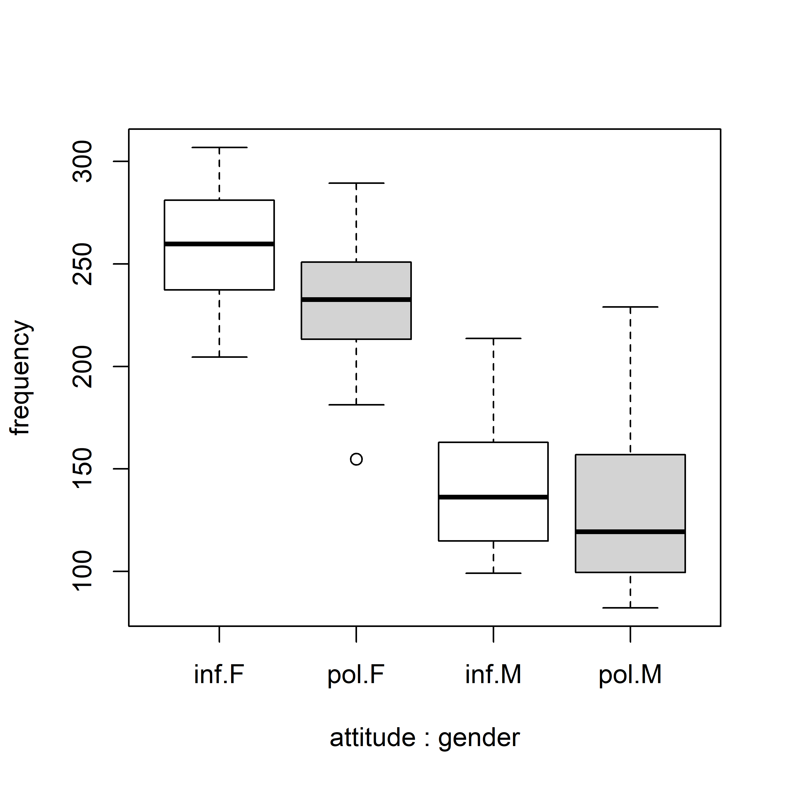

# Mixed Models

References: Nesting and Mixed Effects: Part II, Meier. <https://stat.ethz.ch/~meier/teaching/anova/index.html> An Introduction to Linear Mixed-Effects Modeling in R, Brown

Linear models and linear mixed effects models in R with linguistic applications. (Winter)

## Linear regression

### Example

Consider and example with columns: individual subject ID, subject groups, and data value. The linear model of $data \sim group$, or data as a function of group, has $group$ as a *fixed effect* and is the structural part of the model. Random factors include influences not included in $group$ and is represented by the error term $\epsilon$ and is the random part of the model.

$$ data \sim group + \epsilon$$

### lm()

When using `lm()`, $\epsilon$ is not specified. `summary()` gives the coefficients of the fixed effects. `Multiple R-squared` is the statistic $R^2$ or the variance explained by the model with a range of 0 to 1. `Adjusted R-squared` or $R^2_{adj}$ describes the variance explained by the model, down adjusted by the number of fixed effects. The `p-value` is the probability of obtaining this data under the condition that the null hypothesis is true. The null hypothesis is the model has no effect. 

### Reporting

Reporting: E.g., results of `F-statistic: 46.61 on 1 and 4 DF,  p-value: 0.002407` reported as "We constructed a linear model of $data$ as a function of $group$. This model was significant (F(1,4)=46.61, p\<0.01)."

The linear model expresses categorical differences as a slope between the means of the two categories. In this example, $group$ has two categories. The two $group$ categories are selected alphabetically, with the first at $x=0$ and the second at $x=1$ of the linear model plot. The mean of the first category is the intercept, referred to as $(Intercept)$ in the `Coefficients` table. The difference between the mean of the first category and the mean of the second category is the slope, referred to as the combined term $groupcategory$ in the table. The $groupcategory$ coefficient is the slope (positive or negative). The coefficients' p-values are asking if the values are different from zero. The $groupcategory$ coefficient will have the same p-value as the overall p-value if there is only one fixed effect.

The same principle applies for continuous data. 

## Multiple linear regression

$$ data \sim group1 + group2 + ... + \epsilon$$

### Assumptions
- Linearity: attempt e.g., log transformation if not linear.
- Absence of collinearity: the fixed effects are not correlated with each other.
- Homoskedasticity: check the residual plot.
- Check influencial data points. See `dfbeta()`.
- Independence: each data point comes from a subject completely independent of the others.

### Mixed models

Mixed models add structure to the random $\epsilon$ aspect of the model, leaving the systematic fixed part unchanged.

The independence assumption is violated if there are mutiple measures per subject. Subject variation will result in a different baseline $data$ values for each subject, and can be modeled as a _random effect_, in this case a _random intercept_ for each subject. Each subject is assigened its own intercept value. Here, it is assumed the treatment effect is the same on all subjects, therefore the slope for each subject's $data$ is the same.

### Notation

$$data \sim group1 + group2 + (1|subject) + \epsilon$$

The notation $(1|subject)$ says to assume the intercept is different for each subject. 

If there is an additional source of non-dependence: e.g., 

$$data \sim group1 + group2 + (1|subject) + (1|item) + \epsilon$$

Here, item is an additional source of non-independence: scenarios that the subjects experience that may influence the data. This model has different intercepts for subjects and different intercepts for scenarios (items). In this case the model knows there are mutliple responses per subject and multiple responses per scenario (item). 

### lmer()

The *lme4* package uses the `lmer()` function as the equivalent to `lm()`.

### Example 1

The example data set is `politeness`. Along the x-axis, inf and pol is the attitude (informal and polite), and F and M is the gender. Frequency, along the y-axis is the pitch. 



```
politeness.model = lmer(frequency ~ attitude + (1|subject) + (1|scenario), data=politeness)
```

The output for the random effects:

```
Random effects:
 Groups   Name        Variance Std.Dev.
 scenario (Intercept)  219     14.80
 subject  (Intercept) 4015     63.36
 Residual              646     25.42   
 ```

`Std.Dev` describes how much variability there is in the frequency (the dependent measure) due to `scenario` and `subject` (the random effects). Note under this model, `subject` incorporates both M and F, and the variability is relatively large. `Residual` is the variability not due to the specified random effects. It is the remaining $\epsilon$. 

The output for the fixed effects:

```
Fixed effects:
            Estimate Std. Error t value
(Intercept)  202.588     26.754   7.572
attitudepol  -19.695      5.585  -3.527
```

The fixed effect output is as from `lm()`.

### Example 2

Adding `gender` as a fixed effect, but keeping the  `subject` and `scenario` variability as a random effect.

```
politeness.model = lmer(frequency ~ attitude + gender + (1|subject) + (1|scenario), data=politeness)
```

Output when including gender:

```
Random effects:
 Groups   Name        Variance Std.Dev.
 scenario (Intercept) 219.5    14.81   
 subject  (Intercept) 615.6    24.81
 Residual             645.9    25.41   
 ```
 
 The variation associated with `subject` decreased because gender is now specified in the model.

 ```
Fixed effects:
            Estimate Std. Error t value
(Intercept)  256.846     16.116  15.938
attitudepol  -19.721      5.584  -3.532
genderM     -108.516     21.013  -5.164
```

Males and females differ by about 109 Hz. The effect of attitude did not change much.

## Significance of fixed effect

### Likelihood ratio test

*Likelihood* is the probablility of collecting the data given the model. The likelihood ratio test compares the likelihood of two models, the first model without the factor of interest (the *null model*) and the second model with the factor of interest. We conclude a fixed effect is significant if the difference between the likelihood of the two models is significant. 

### Example

Is `attitude` associated with `frequency`? 

`REML=FALSE` must be specified when comparing models with the likelihood ratio test.

The null model excluding attitude: 
```
politeness.null = lmer(frequency ~ gender + (1|subject) + (1|scenario), data=politeness, REML=FALSE)
```

The model including attitude:
```
politeness.model = lmer(frequency ~ attitude + gender + (1|subject) + (1|scenario), data=politeness, REML=FALSE)
```

The likelihood ratio test is implemented using `anova()`.

```
anova(politeness.null,politeness.model)
```

