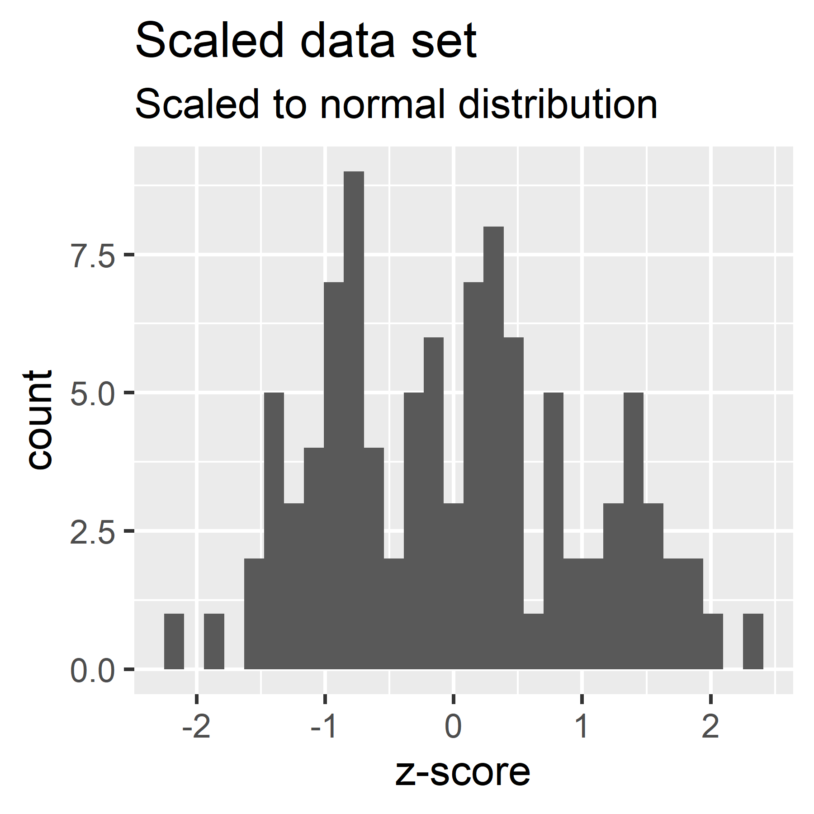
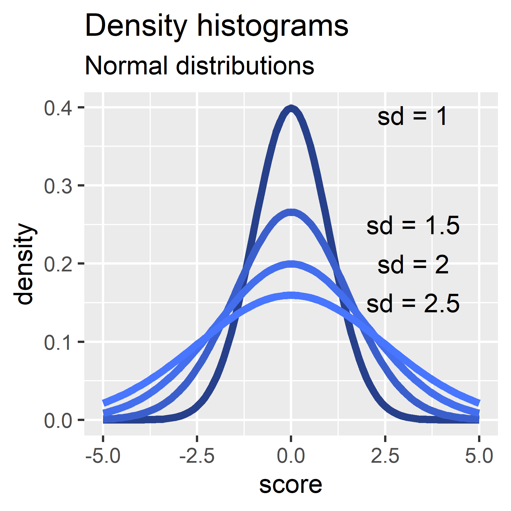
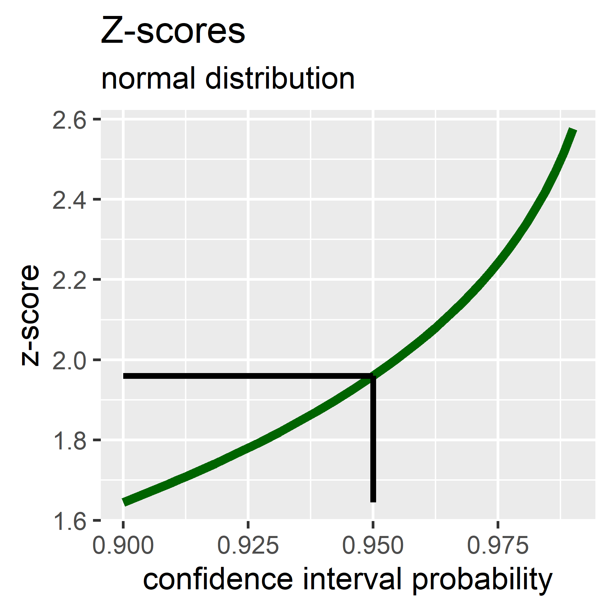
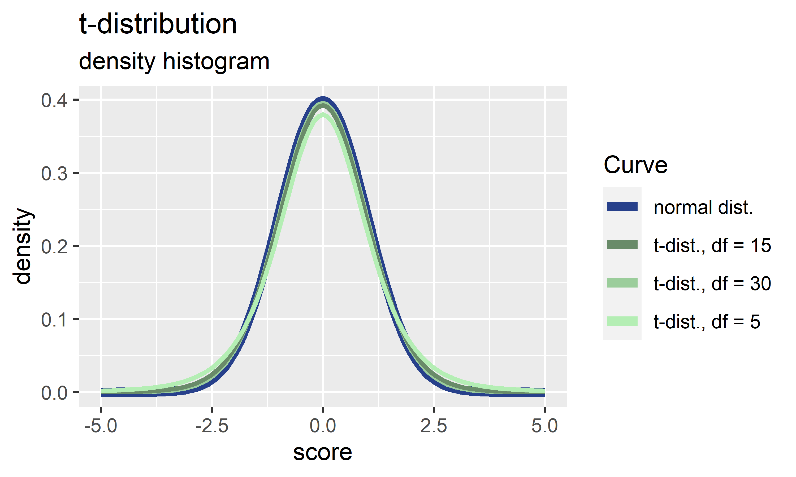

Compiled from Field, Andy; Miles, Jeremy; Field, Zoe. Discovering Statistics Using R. SAGE Publications. Kindle Edition.

```{r message=FALSE, warning=FALSE}
library(tidyverse)
```

# Definitions

**Sample**: Data collected from the subset of a population.

**Median**:

**Mean**: The mean is a simple statistical model.

$$\bar{X} = \frac{\sum_{i=1}^{n}x_i}{n}$$

**Standard error**: Several samples from the same population will differ due to sampling variation. The sampling distribution consists of the sample means as a frequency distribution. The standard deviation of the sample means is the standard error of the mean (SE). The central limit theorem states for sample numbers \> 30, the sampling distribution is normal with a mean equal to the population mean and a standard deviation of

$$\sigma_{\bar{x}} = s/\sqrt N$$

This equation approximates the standard error. For sample numbers \< 30 the sampling distribution has a different shape, the t-distribution.

**Degrees of freedom (df)**: Related to the number of observations that are free to vary. E.g. if a sample mean is 10, it is assumed the population mean is also 10. With this parameter fixed, only n -- 1 of the scores can vary. The nth score must be fixed to keep the mean constant.

**Independent variable**: causes the effect (aka predictor variable); its value does not depend on any other variable. **Dependent variable**: the effect (aka outcome variable); it depends on the independent variable. **Categorical variable**: distinct entities (categories). Binary: two categories. Nominal: numbers represent category names. Ordinal: ordered nominal data. **Continuous variable**: numeric value on a measurement scale. Interval: a scale with equal intervals between possible values. Ratio: ratio of values is meaningful (scale has a zero point). Discrete: only certain allowed variables in the scale. **Confounding variable**: a variable other than the predictor that may affect the outcome.

**Correlational or cross-sectional** research is observational without manipulation. In experimental research, the variable(s) is manipulated, and its effect measured.

Outcome data can be predicted from the **model and error**. Model goodness of fit can be assessed by the deviation.

$$outcome_i = model + error_i$$ $$deviation = \sum(observed - model)^2$$

# Probability Distributions

Distributions show the frequency (or probability) of obtaining a particular score. **Normal distribution**: mean of zero and standard deviation of 1. Probability distributions are idealized. The probability of obtaining a particular score (x-axis) can be calculated based on the frequency of the score in the distribution. Score probabilities have been calculated for the normal distribution ($\bar{x} = 0$ and $s = 1$).

```{r fig.width=3}
df <- read_csv(file = 'input_1.csv')
p <- ggplot(df, aes(day1)) +
  geom_histogram(aes(y = ..density..), colour = 'black', fill = 'white') +
  labs(x = 'Hygiene score on day 1', y = 'Density',
       title = 'Density histogram', subtitle = 'Normal distribution') +
  stat_function(fun = dnorm,
                args = list(mean = mean(df$day1, na.rm = TRUE), 
                            sd = sd(df$day1, na.rm = TRUE)),
                colour = 'red', size = 2)
print(p)
png(filename = 'statistics_1_histogram.png', width = 3, height = 3, units = 'in', res = 600)
print(p)
dev.off()
```

In a density histogram the area of each bin equals its relative frequency, and the area of the entire histogram is one.

A data set of scores converted to the normal distribution have **z-scores (z)**, of

$$z = \frac{x_i - \bar{x}}{s}$$

where $x_i$ = score, $\bar{x}$ = mean score, and $s$ = standard deviation. Dividing by s results in data with a standard deviation of 1.

{width="220"} {width="221"}

Generated using rnorm() and scale().

```{r}
x <- rnorm(100, mean = 10, sd = 5)
p <- ggplot() + geom_histogram(aes(x), bins = 30) +
  labs(x = 'score', y = 'count', title = 'Data set', subtitle = 'Mean = 10, SD = 5')
print(p)
png(filename = 'statistics_1_zscore1.png', width = 3, height = 3, units = 'in', res = 600)
print(p)
dev.off()
```

```{r}
y <- scale(x, center = TRUE, scale = TRUE)
p <- ggplot() + geom_histogram(aes(y), bins = 30) +
  labs(x = 'z-score', y = 'count', title = 'Scaled data set', 
       subtitle = 'Scaled to normal distribution')
print(p)
png(filename = 'statistics_1_zscore2.png', width = 3, height = 3, units = 'in', res = 600)
print(p)
dev.off()
```

# Variance and Standard Deviation

The fit of the mean as a model: Deviance is the difference between the data and the model at an independent (x-axis) variable value (i.e., the error in the model prediction at that point). In the case of the mean as the model of the data set, the **deviance** is $x_i - \bar{x}$, where $x_i$ is a data point, and $\bar{x}$ is the mean of the data set. The total error is then the sum of the deviance, $\sum(x_i - \bar{x})$. But, with this method the total negative and positive deviance of the data set cancel. To prevent this, use the sum of squared errors (SS) where $SS = \sum(x_i - \bar{x})^2$, but this value will be dependent upon the number of data points. Therefore the **variance** ($s^2$) is used, where N is the number of observations. $s^2 = \frac{SS}{N-1} = \frac{\sum(x_i - \bar{x})^2}{N - 1}.$ The variance is in units squared since each deviance is squared. To return to the original units, use the **standard deviation** ($s$).

$$s = \sqrt{\frac{\sum(x_i - \bar{x})^2}{N - 1}}.$$

# Standard Error of the Mean

**The standard error of the mean (SE)** is the standard deviation of sample means. It represents how well a sample (draw) represents the population. Draws from a population will have a sampling variance. These sampling means have a frequency distribution aka **sampling distribution**. The sampling distribution is the frequency distribution of sample means, and is represented by the SE. For n \> 30, the **central limit theorem** states that

$$SE = \frac{s}{\sqrt{N}}$$

(approximate). For n \< 30 the sampling distribution is approximated by the t-distribution.

# Confidence Intervals

Confidence intervals are estimated boundaries within which the true mean is likely to fall. If 95% confidence intervals of two samples do not overlap, we can infer the two means are from different populations. The standard error is $SE=s/\sqrt N$. Values of z-scores between -1.96 to 1.96 contain 95% of the scores. The central limit theorem states the standard deviation of the sample means (i.e., the standard error) will be normally distributed. For large samples of n \> 30:

$$1.96 = \frac{x-\bar{x}}{SE} \Rightarrow x = (1.96 \times SE) + \bar{x}$$

The mean is the center of the confidence interval:

-   Lower bound of the 95% confidence interval = $\bar{x} - (1.96 \times SE)$

-   Upper bound of the 95% confidence interval = $\bar{x} + (1.96 \times SE)$

Generally, where p is the probability value of the confidence interval:

-   Lower bound of confidence interval = $\bar{x} - (z_\frac{1-p}{2} \times SE)$

-   Upper bound of confidence interval = $\bar{x} + (z_\frac{1-p}{2} \times SE)$

The probability is split in half and on both ends of the distribution. Density histograms of various normal distributions:

{width="286"}

```{r}
p <- ggplot(data.frame(x = c(-5, 5)), aes(x)) + 
  labs(x = 'score', y = 'density',
       title = 'Density histograms', subtitle = 'Normal distributions') +
  stat_function(fun = dnorm,
                args = list(mean = 0, sd = 1),
                colour = 'royalblue4', size = 1.5) +
  stat_function(fun = dnorm,
                args = list(mean = 0, sd = 1.5),
                colour = 'royalblue3', size = 1.5) +
  stat_function(fun = dnorm,
                args = list(mean = 0, sd = 2),
                colour = 'royalblue2', size = 1.5) +
  stat_function(fun = dnorm,
                args = list(mean = 0, sd = 2.5),
                colour = 'royalblue1', size = 1.5) +
  annotate("text", x = 3.25, y = 0.39, label = "sd = 1") +
  annotate("text", x = 3.25, y = 0.25, label = "sd = 1.5") +
  annotate("text", x = 3.25, y = 0.2, label = "sd = 2") +
  annotate("text", x = 3.25, y = 0.15, label = "sd = 2.5")
print(p)
```

Generated using dnorm(). Z-scores over a range of typical confidence interval probabilities: .

```{r}
prob <- seq(from = 0.90, to = 0.99, length.out = 50)
z <- qnorm((1 - prob)/2, lower.tail = FALSE)
x1 <- 0.95; x2 <- qnorm((1 - x1)/2, lower.tail = FALSE)
p <- ggplot(data.frame(x = prob, y = z), aes(x = x, y = y)) +
  geom_line(color = 'darkgreen', size = 1.5) +
  geom_segment(aes(x = x1, y = z[1], xend = x1, yend = x2), size = 1) +
  geom_segment(aes(x = x1, y = x2, xend = prob[1], yend = x2), size = 1) +
  labs(x = 'confidence interval probability', y = 'z-score', title = 'Z-scores', 
       subtitle = 'normal distribution')
print(p)
png(filename = 'statistics_1_z_scores.png', width = 3, height = 3, units = 'in', res = 600)
print(p)
dev.off()
```

Generated using qnorm().

For smaller samples of n \< 30, the t-distribution is followed. The t-distribution approaches the normal distribution as the number of samples increases: t-distributions at varying degrees of freedom and compared to the normal distribution .

```{r}
p <- ggplot(data.frame(x = c(-5, 5)), aes(x)) + 
  labs(x = 'score', y = 'density',
       title = 't-distribution', subtitle = 'density histogram') +
  stat_function(fun = dnorm,
                args = list(mean = 0, sd = 1), aes(color = "normal dist."), size = 2) +
  stat_function(fun = dt,
                args = list(df = 30), aes(color = 't-dist., df = 30'), size = 1) +
  stat_function(fun = dt,
                args = list(df = 15), aes(color = 't-dist., df = 15'), size = 1) +
  stat_function(fun = dt,
                args = list(df = 5), aes(color = 't-dist., df = 5'), size = 1) +
  scale_color_manual('Curve', 
                     values = c('royalblue4', 'darkseagreen4', 'darkseagreen3', 'darkseagreen2'))
print(p)
png(filename = 'statistics_1_t_dist.png', width = 5, height = 3, units = 'in', res = 600)
print(p)
dev.off()
```

Generated by dt().
