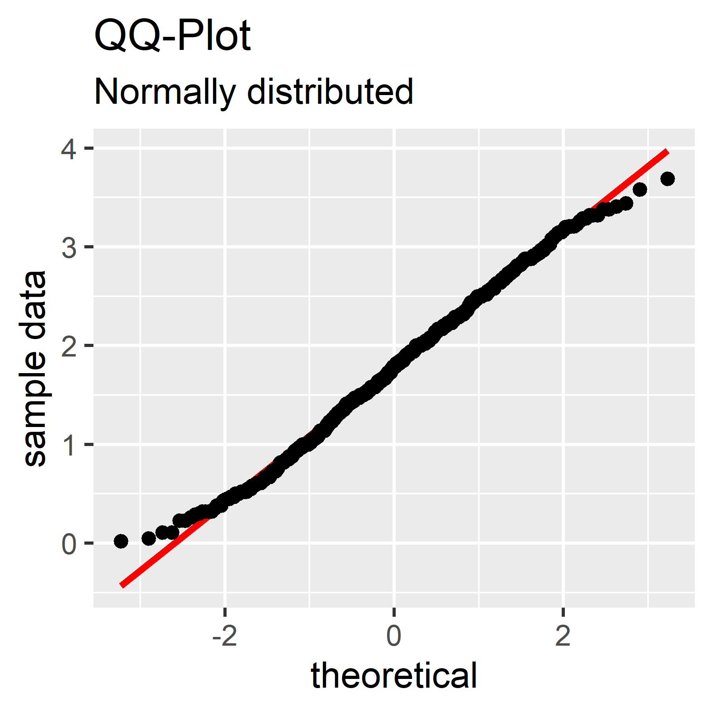

Compiled from Field, Andy; Miles, Jeremy; Field, Zoe. Discovering Statistics Using R. SAGE Publications. Kindle Edition.

```{r message=FALSE, warning=FALSE}
library(tidyverse)
```

# Inferential Statistics

Procedure: 1) Develop the null hypothesis and alternative hypothesis. 2) Given data fit a statistical model that represents the alternative hypothesis. If it fits (explains the variance in scores) this indicates the alternative hypothesis is true. 3) Calculate the probability the model would fit if the null hypothesis were true. As this probability decreases, there is greater confidence the alternative hypothesis is true. The ratio of systematic to unsystematic variance is a **test statistic** (e.g., t, F, $\epsilon^2$):

$$test\:statistic = \frac{variance\:explained\:by\:model}{variance\:not\:explained\:by\:model} = \frac{effect}{error}$$

For a particular test statistic, it is known how frequently different values of the statistic occur. This is used to calculate the probability of obtaining the test statistic value, and therefore how likely it would be to obtain the value under the null hypothesis. As test statistic values get larger, the probability of occurrence under the null hypothesis gets smaller. The test statistic value is significant when the probability is less than 0.05 (Fisher's criterion, or $\alpha$-level).

## One- and two- tailed tests

A model that tests a directional hypothesis is a one-tailed test and one that tests a non-directional hypothesis is a two-tailed test. In a two-tailed test, the criterion probability of 0.5 is split, with 0.25 on both the negative and positive ends of the test statistic distribution.

## Type I and II errors

**Type I error**: We believe there is an effect in the population, but there is in fact not. A false positive. The probability of this occurring is the $\alpha$-level of typically 0.05 (5%). **Type II error**: We believe there is no effect in the population, but in fact there is. A false negative. Ideally, the probability of this error, the $\beta$-level, is less than 0.2 (20%). Natural variation in samples will cause an increase in the $\beta$-level.

## Effect sizes

Effect size is an objective and standardized measure of the magnitude of an observed effect (perhaps the importance of a research finding). Effect sizes include Cohen's d, **Pearson's correlation coefficient** $r$, and the odds ratio. For $r$, $r$= 0.10 indicates a small effect that explains 1% of the total variance, $r$= 0.30 indicates a medium effect that explains 9% of the total variance, and $r$= 0.50 indicates a large effect that explains 25% of the total variance.

## Statistical Power

Statistical power is the ability (probability) of a test to detect a particular effect size. It depends on the sample size and $\alpha$-level (accepted false positive rate). The probability of detecting an effect if one exists is the opposite of not detecting that effect, or 1 - $\beta$-level (false negative probability). Per Cohen references, the $\beta$-level should be at least 0.2, therefore the statistical power should be 1 - 0.2 = 0.8 (80% probability of detecting an effect if one exists). If we know the $\alpha$-level, $\beta$-level, and a known or estimated effect size, the necessary sample size can be calculated. See Cohen 1988, Cohen 1992, and the pwr package. The calculation depends on the type of hypothesis test.

# Assumptions of Parametric Data

The assumptions are 1. Normally distributed data (sampling distribution or errors in the model, depending on the test). 2. Homogeneity of variance: variance is the same throughout the data. When testing groups: samples come from populations with the same variance. When testing correlations: variance of one variable is stable across the other variable. 3. Interval data (a scale with equal intervals between possible values). 4. Independence: data from different groups is independent (depending on the test).

## Normality Assumption

Many statistical tests assume the sampling distribution (not sample data) is normal (e.g., the t-test). However, we don't know the sampling distribution. From the central limit theorem, if the sample data is normal then the sampling distribution is normal. Test plots: 1. histogram of data with dnorm() generated normal curve. 2. Quantile-quantile (Q-Q plot). **Quantile** is the proportion of cases below a certain value. Each data point is compared to the expected value if the data was normally distributed. Deviations from the diagonal are changes from normality. . Skew and kurtosis can be calculated (e.g., e1071 package).

```{r}
df <- read_csv(file = 'input_1.csv')
p <- ggplot(df, aes(sample = day1)) +
  labs(x = 'theoretical', y = 'sample data',
       title = 'QQ-Plot', subtitle = 'Normally distributed') +
  stat_qq_line(color = 'red', size = 1) + 
  stat_qq()
print(p)

png(filename = 'statistics_1_qq.png', width = 3, height = 3, units = 'in', res = 600)

print(p)
dev.off()
```

### Shapiro-Wilk Test

The **shapiro-wilk test** compares sample scores to a normally distributed set of scores with the same mean and standard deviation. Non-significance (p \> 0.05) means the sample scores are not different from a normal distribution. Significance (p \< 0.05) means they are different (non-normal). Limitation: with large sample sizes small deviations from normality may lead to significant results, even if this deviation would not bias a statistical procedure. Always plot with histogram or qq-plot to make informed decision.

> shapiro.test(rexam\$exam)

Shapiro-Wilk normality test

data: rexam\$exam W = 0.96131, p-value = 0.004991

Example reporting: The score on the exam, W = 0.96, p = 0.005, was significantly non-normal.

## Homogeneity of Variance Assumption

First plot the data showing the variance in the groups of interest. **Levene's test** tests the null hypothesis that variance in different group means are equal. It performs a one-way ANOVA on the deviation scores (the absolute difference between each score and the mean of the corresponding group). Significance (p \< 0.05) means the null hypothesis is incorrect and the variances are significantly different. Non-significance (p \> 0.05) means the variances are equal. Limitation: when the sample size is large, small variance differences may produce a significant p-value that would not bias a statistical procedure.

> library(car)

> leveneTest(rexam$exam, rexam$uni) \# first arg: variable to test, second arg: grouping variable

Levene's Test for Homogeneity of Variance (center = median) Df F value Pr(\>F) group 1 2.0886 0.1516 98

Result is non-significant (Pr(\>F) \> 0.05), indicating the variances are not different.

Example reporting: General form F(df1, df2) = value, Pr(\>F). Variances were similar F(1,98) = 2.1, p = 0.15.

# Transforming Data

It may be better to use non-parametric or robust tests rather than transform data to meet the normality and variance assumptions of parametric hypothesis tests.

Section 5.8.3 discusses outlier removal and transformations.

# Covariance

Are two variables associated? When one variable deviates from its mean, does the other vary from its mean in the same way? Variance (single variable): $s^2 = \frac{SS}{N-1} = \frac{\sum(x_i - \bar{x})^2}{N - 1}$. For covariance (two variables): To remove the problem of + and - deviations cancelling each other out, multiply the deviation for one variable by the corresponding deviation for the second variable. **Covariance**:

$$cov(x,y) = \frac{\sum(x_i - \bar{x})(y_i - \bar{y})}{N - 1}$$.

A positive covariance indicates both variables increase, and negative covariance indicates one increases and the other decreases. The covariance value depends on the scale of measurement.

# Correlation Coefficient

The standard deviation is used to standardize (normalize) the unit of measurement. The standardized covariance is the **correlation coefficient**, aka **Pearson correlation coefficient** ($r$), where $s_x$ is the standard deviation of the first variable and $s_y$ is the standard deviation of the second.

$$r = \frac{cov_{x,y}}{s_xs_y} = \frac{\sum(x_i - \bar{x})(y_i - \bar{y})}{(N - 1)s_xs_y}$$

The value of $r$ will be between -1 and +1, which indicate perfect negative and positive correlations. Zero indicated no linear relationship. The $r$ value is also commonly used measure of the size of an effect and that values of ±0.1 represent a small effect, ±0.3 is a medium effect and ±0.5 is a large effect.

Correlation coefficient hypothesis tests examine if the correlation is different from zero (different from no relationship between the two variables). Confidence intervals can be computed for $r$.

In R, `cor()` and `cor.text()` compute the correlation coefficient ($r$). `cor()` can perform multiple correlations; `cor.test()` provides the p-value and confidence interval.

# Handbook of Biological Statistics

# Tests for nominal (categorical) variables

A nominal variable is a categorical assignment.

## Exact test of goodness-of-fit

The exact test of goodness-of-fit is used when there is one nominal (categorical) variable, you want to see whether the number of observations in each category fits a theoretical expectation, and *the sample size is small*.

## Chi-square test of goodness-of-fit

You use the chi-square test of goodness-of-fit when you have one nominal variable, you want to see whether the number of observations in each category fits a theoretical expectation, *and the sample size is large*.

## Fisher's exact test of independence

Use Fisher's exact test of independence when you have two nominal variables and you want to see whether the proportions of one variable are different depending on the value of the other variable. Use it when the *sample size is small*.

## Chi-square test of independence

Use the chi-square test of independence when you have two or more nominal variables and you want to see whether the proportions of one variable are different for different values of the other variable. Use it when the *sample size is large*. For example, nominal variable 1: Treatment vs control and Nominal variable 2: Effect observed vs no effect observed.

## G-tests

These tests have the same purpose as the chi-square tests. - G-test of goodness of fit - G-test of independence

## Repeated G-tests of goodness of fit

Use this method for repeated G--tests of goodness-of-fit when you have two nominal variables; one is something you'd analyze with a goodness-of-fit test, and the other variable represents repeating the experiment multiple times.

## Power analysis G power <https://www.psychologie.hhu.de/arbeitsgruppen/allgemeine-psychologie-und-arbeitspsychologie/gpower>

# Descriptive statistics of measurement (continuous) variables

Normal probability distribution can be described by two parameters, the mean and the variance. Statistical tests that assume a normal distributions are therefore called **parametric tests**. If the distribution of a variable is not normal, the data can be converted to ranks and analyzed using **non-parametric tests**.

## Central tendency

Central tendency is the middle of a set of measurements. The central limit theorem states that the sum of individual distributions of different variables is normally distributed, even if the individual distributions are non-normal. The sum fits a normal distribution better as the number of variables increases. ...

## Dispersion

## Standard error of the mean

## Confidence limits

# Tests for one measurement variable

t-statistic:

$$t_s = \frac{\bar{x} - \mu_0}{s/\sqrt{n}}$$

# R Model Formula

<https://r4ds.had.co.nz/model-basics.html> <https://www.jstor.org/stable/2346786> Symbolic Description of Factorial Models for Analysis of Variance

`y ~ model` is interpreted as the response `y` modeled by the linear predictor `model`. A model consists of terms separated by `+` operators. The terms consist of variable and factor names separated by `:` operators. A term is interpreted as the interaction of all the variables and factors appearing in the term. The `*` operator denotes factor crossing. Factors are predictor variables, and can be crossed or nested.

See `model_matrix` for how the predictors are set up by the model formula. `model_matrix` creates a design matrix.

```{r}
library(modelr)
dd <- data.frame(a = gl(3,4), b = gl(4,1,12)) # balanced 2-way
dd
model_matrix(dd, a ~ b)
```

https://r4ds.had.co.nz/model-basics.html#formulas-and-model-families

## Simple Linear Regression

$$y_i = \beta_0 + \beta_1x_i + \epsilon_i$$

```{r}
set.seed(42)
x <- rnorm(100)
e <- rnorm(100, mean = 0, sd = 5)
y <- 5 + 15 * x + e
lm(y ~ x)
```

Therefore the regression equation is:

$$y_i = 4.558 + 15.136x_i + \epsilon_i$$ \# Mixed Models

References: Nesting and Mixed Effects: Part II, Meier. <https://stat.ethz.ch/~meier/teaching/anova/index.html> An Introduction to Linear Mixed-Effects Modeling in R, Brown
